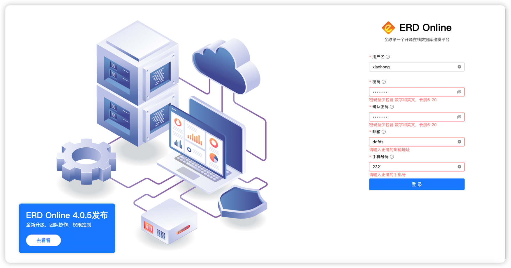

:::tip
ERD Online 定义了元数据基本结构和存储形式，并提供了前后端配套的功能模块，大家在使用ERD Online的过程中，也许ERD Online现有的功能不能满足你的业务需要，这时候，就需要自定义开发一些功能。<br/>
:::

## 快速定制（本地无需启动后端服务）

- 拉取前端代码
```shell
git clone https://github.com/www-zerocode-net-cn/ERD-Online.git
```

- 打开ERD Online [体验网址](https://erd.zerocode.net.cn/register)，注册一个账号



- 使用vscode或者其它开发工具打开项目

- 修改 `.local.env`

```properties
API_URL=https://erd.zerocode.net.cn
```

- 启动项目
```shell
yarn && yarn start
```

- 打开浏览器，输入`http://localhost:8000/`

- 使用刚才注册的用户名和密码登录系统

:::tip
这样就到到本地启动ERD Online的目的，而且本地无需启动后台服务，即可快速定制自己想要的元数据管理平台。
:::