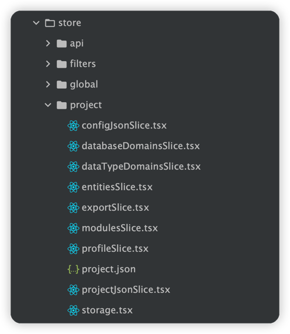

:::tip
这里包括前端和后端用到的技术栈，后端相对来说比较稳定，所以主要对前端技术栈做介绍，方便大家后面自定义拓展
:::

## ERD Online技术栈

- 前端：React + [Ant design](https://github.com/ant-design/ant-design) + [Zustand](https://github.com/pmndrs/zustand)
- 后端：Java8 + Spring Boot2 + Maven3 + Mysql8

## Zustand

>- A small, fast and scalable bearbones state-management solution using simplified flux principles. Has a comfy api based on hooks, isn't boilerplatey or opinionated

简而言之，Zustand 是一种前端状态管理技术，类似于Redux。

ERD Online 正是借助 Zustand 强大的状态管理技术，实现跨页面操作元数据大JSON，实现页面和js分离。

## Zustand 用法

>- ERD Online 中，操作大JSON的方法，都提取到了`src/store`这里,在这里管理了 ERD Online 对大json的全部操作
>- 甚至，由于做到了页面和js分离，你可以把 ERD Online 从React 项目改造成 Vue项目（理论可行，因为Ant Design也有Vue版）



## ERD ONLINE 中的 Zustand

```typescript jsx
export type ProjectState =
  {
    tables: any[],
    project: any,
    fetch: () => Promise<void>;
    dispatch: IProjectJsonDispatchSlice & IConfigJsonDispatchSlice & IModulesDispatchSlice
      & IDataTypeDomainsDispatchSlice & IDatabaseDomainsDispatchSlice & IProfileDispatchSlice
      & IEntitiesDispatchSlice & IExportDispatchSlice
  }
  & IProjectJsonSlice
  & IConfigJsonSlice
  & IModulesSlice
  & IDataTypeDomainsSlice
  & IDatabaseDomainsSlice
  & IProfileSlice
  & IExportSlice
  & IEntitiesSlice;

// Turn the set method into an immer proxy
// @ts-ignore
export const immer = config => (set, get, api) => config((partial, replace) => {
  console.log(51, "partial", partial)
  console.log(52, "replace", replace)
  const nextState = typeof partial === 'function'
    ? produce(partial)
    : partial;
  return set(nextState, replace);
}, get, api)

const useProjectStore = create<ProjectState, SetState<ProjectState>, GetState<ProjectState>, StoreApiWithSubscribeWithSelector<ProjectState>>(
  subscribeWithSelector(
    immer(
      (set: SetState<ProjectState>, get: GetState<ProjectState>) => ({
        tables: [],
        project: {},
        fetch: async () => {
          const projectId = cache.getItem(CONSTANT.PROJECT_ID);
          await request.get(`/ncnb/project/info/${projectId}`).then((res: any) => {
            console.log(45, res);
            const data = res?.data;
            if (res?.code === 200 && data) {
              set({project: data});
              get().dispatch.fixProject(data);
              //计算全部表名
              const tables = _.flatMapDepth(data?.projectJSON?.modules, (m) => {
                console.log(130, m);
                return _.map(m.entities, 'title')
              }, 2);
              set({
                tables
              })
            } else {
              message.error('获取项目信息失败');
            }
          });
        },
        dispatch: {
          updateProjectName: (payload: any) => set((state: any) => {
            // @ts-ignore
            state.project.projectName = payload;
          }),
          ...ProjectJsonSlice(set, get),
          ...ConfigJsonSlice(set, get),
        }
      })
    )
  )
);

const globalState = useGlobalStore.getState();
// @ts-ignore
useProjectStore.subscribe(state => state.project, (project, previousProject) => {
  console.log(109, project);
  console.log(110, previousProject);
  globalState.dispatch.setSaved(false);
  Save.saveProject(project);
  globalState.dispatch.setSaved(true);
});

export default useProjectStore;
```


