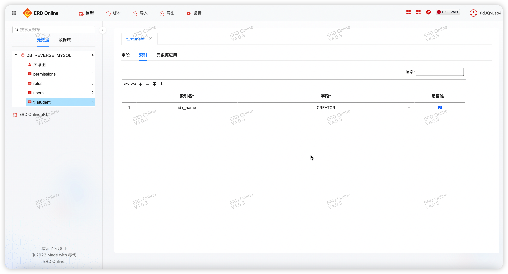
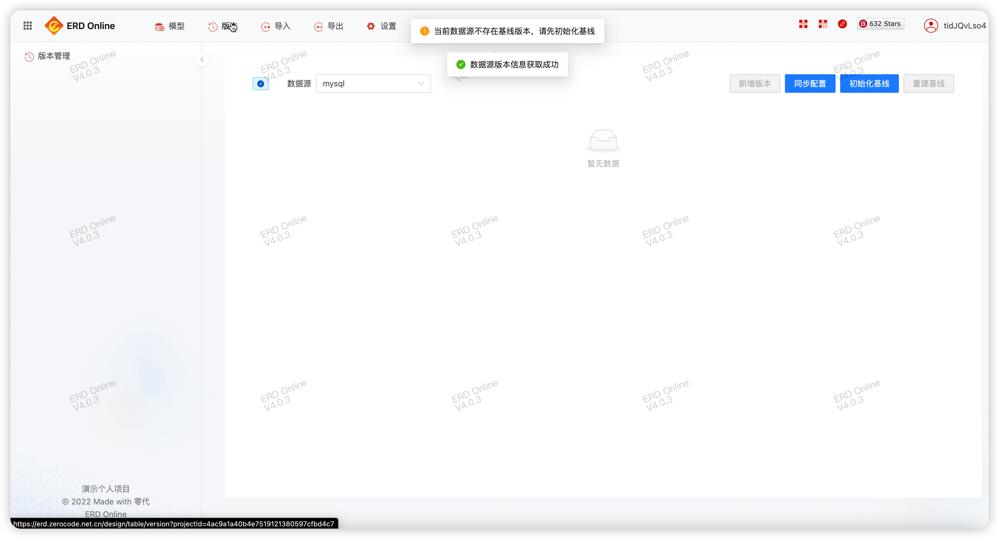

ERD Online操作指引! 🔥🎶

### 登录ERD Online

- 老用户使用微信扫码登录，可自动关联原有全部模型
- 新用户可以使用微信扫码快捷登录，也可自行注册新账号


### 首页工作台

扫码登录到系统之后，首页会显示ERD Online 统计信息、和一些快捷入口


### 新增项目

点击「个人项目」，这里展示了全部的历史个人项目


点击「新建」，录入项目相关的信息，点击保存即可


### 新增模块

我们用上面新建的项目，演示新增模块，新增模块有两种方式：

- 1、手动增加模块
- 2、从数据库逆向解析生成模块

1、手动增加模块

「打开模型」之后,看到如下页面


点击左侧「新增模块」，录入模块信息，模块名为业务中的英文名，中文名称为模块中文解释


点击「确定」，这样就建好了自己的第一个模块，新建的模块中还没有任何业务表，后面章节我们会讲如何新增表

2、从数据库逆向解析生成模块

我们接上一节，演示如何逆向解析

从数据库逆向解析需要配置数据库

点击上方「设置」，再选择「数据源设置」


点击「新增」 配置一个数据库连接，目前为止，支持 MYSQL、ORACLE、SQLSERVER、DB2(需要开启 oracle 兼容模式)、POSTGRESQL

录入数据库配置信息

点击「测试」，提示：连接成功，说明该数据库连接配置正常


点击上方「导入」，再选择「数据源逆向解析」


数据库选择刚才新增的数据库 mysql，逻辑名格式选择不处理，点击下一步


选中需要逆向解析的表，点「提交」


点击上方「模型」，数据库中的元数据就到了 ERD Online


### 新增表

在模块名称上右键，选择「新建表」


点击「确认」，在模块下就有了新增的表

左键单击右侧数据表，就可以开始设计表了

:::tip
试试在表名上右键吧
:::


到这里，我们的第一个表就建好了

### 表设计

:::tip

- 表设计自动保存
- 表设计支持撤销、重做、开始插入、尾部插入、上方插入、下方插入、拖动排序
- 表设计可以像Excel一样，拖动选框右下角小黑点快速复制

:::

#### 字段信息


#### 索引信息



#### 元数据应用

MYSQL


ORACLE(DB2)


SQLSERVER


POSTGRESQL


JAVA


### 版本管理

:::tip

- ERD提供两种版本管理方案：重建表、字段增量。默认为字段增量。
- 在项目开始，就要考虑好用哪种方式，中途别随意更换，不然会出现版本信息对比不准确。
- 一般情况下，使用默认方式即可。
- 第一次管理版本时，需要初始化基线版本，才能新增版本。
- 可以重建基线，重建之后，历史版本信息将会消失，元数据不受影响。

:::

点击上方「版本」



点击「初始化基线」


录入版本信息，点击「确认」


此时，就有了第一个版本。

:::tip

- 如果在这之前操作过数据库逆向解析，需要将逆向解析出来的元数据标记为已同步，操作步骤：
    - 逆向解析完之后，立即新增一个新版本
    - 点击该版本的「版本变更详情」
    - 点击右下角「标记为已同步」

:::

版本变更详情


任意版本比较


编辑版本


删除版本


同步到数据源

点击此按钮，会将版本变动详情的记录，往数据源执行


再看1.0.0版本，已经为已同步状态


### 导入

- 数据源逆向解析
- 导入PDman
- 导入ERD

### 导出

#### 普通导出

可以导出格式为：HTML\word\Markdown\DDL\ERD文件

- 导出word文档


- 导出 html


- 导出 md


- 导出 ERD 文件（加密导出erd上的元数据，导出之后，可以导入到任何erd系统中）


#### 高级导出

可以选择哪张表


预览


### 设置

#### 数据源设置


#### 默认字段设置（每张表的公有字段）


#### 配置ERD的默认配置


### 数据字典

这个功能可以帮你定义业务领域的数据词典

点击「模型」，点击数据域tab


设计表时可以选择这个业务领域的字段即可


```js
这样大家都遵照规范词典进行数据库设计;
```

