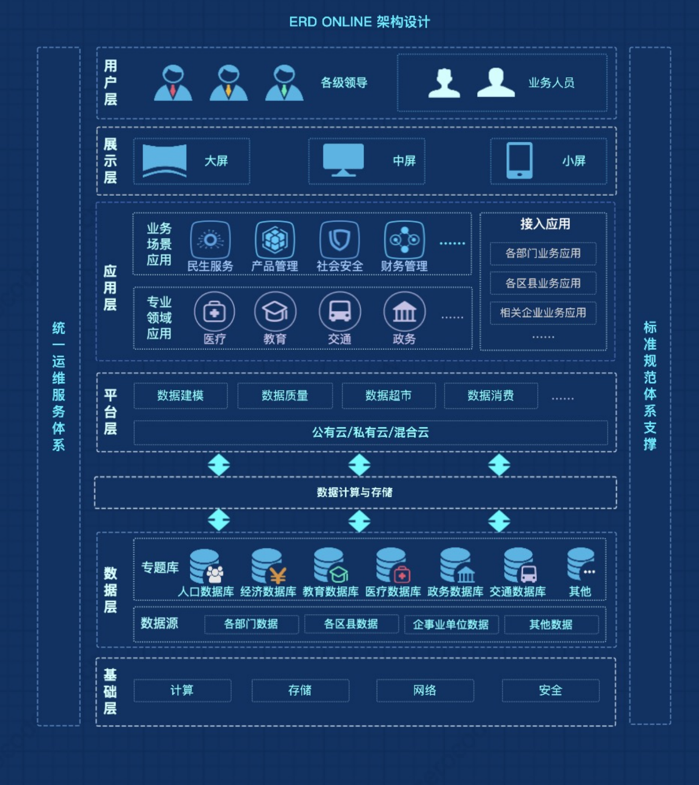

ERD 是Entity-Relationship Diagram的缩写，中文意思为实体关系图，也被称为 ERD、ER 图、实体联系模型、实体联系模式图或 ER 模型，是一种用于数据库设计的结构图。ERD Online为开发者提供一站式的数据库结构设计、版本管理、执行 sql、逆向解析、文档生成功能。🎉**

我们的目标：通过对元数据管理，向大数据、低代码、BI、大屏应用等赋能，让数据成为企业创新的核心引擎。

## 业务架构介绍

## 核心能力

- **元数据解析**
  
  从数据源将元数据解析出来，通过ERD Online在线管理。
  
- **元数据管理**

  这一设计解决了软件开发生命周期中，元数据管理效率低下的问题。
  
- **多数源支持（Mysql、Oracle、Sqlserver、Postgresql）**
  
  支持所有符合SQL规范的数据源，常见的有Mysql、Oracle、Sqlserver、Postgresql。
  
- **多数源同步**
  
  在线ERD Online，多数据源同步。这一设计解决了一个产品需要适配多种不通数据源，不同数据源 SQL 方言不一致问题。
  
- **在线导出 SQL（全量或差量）**

  通过记录元数据变动，形成版本节点，支持不同版本比对，生成各种数据源 SQL 脚本。这一设计解决了产品从开发阶段到生产阶段，差量 SQL 比对费时耗力的问题。  

- **在线执行 SQL**
  
  无需安装第三方数据库管理工具，无需打开Shell窗口，在线往数据源执行 SQL。 这一功能节省了企业大量采购正版数据库管理软件的费用。 

- **数据血缘管理**
  
  在线管理元数据之间的关联关系，形成血缘视图，一目了然。这一设计解决了传统数据关系不清晰，让数据关系梳理更高效。
  
- **团队协作**
  
  精准的权限划分，根据不通角色分配不通功能，保障数据安全。支持多人实时在线协作，自动同步。
  
- **元数据导出（Word、Pdf、Html、Markdown）**
  
  支持导出离线文档 Word、Pdf、Html、Markdown，便于线下流通交流、存档。  

- **官方市场一键导入**
  
  - 官方市场有大量各行业、各类型、各设备、各通讯已有的元数据，可一键导入自己的项目，快速形成自己的元数据结构。
  - 每个仪器、每个软件、每次通讯，他们产生、传递的数据结构都是固定的，可在官方市场搜索并导入，避免重复建设。
  
- **低代码平台（待建设）**
    - BI
    - 大屏
    - 低代码平台
## 为谁服务

* #### 开发工程师
    - 一键解析已有数据源元数据并在线管理，生成差量上线SQL
    - 根据已有的元数据结构，生成项目代码
    - 自定义每个表固定的列
    - BI开发
    - 大屏开发

* #### 架构师
    - 打通产品线所有数据源
    - 所有数据源在线管理，避免数据孤岛
    - 约定数据源字段规范
    - 审计开发人员数据源操作
    
* #### DB 工程师
    - 在线管理数据源元数据，自定义全部数据源看板
    - 审计上线 SQL
    
* #### 项目管理/产品管理/工程效率管理人员
    - 了解产品发展过程中，数据形态以及变化
    - 通过数据去做产品发展决策
    